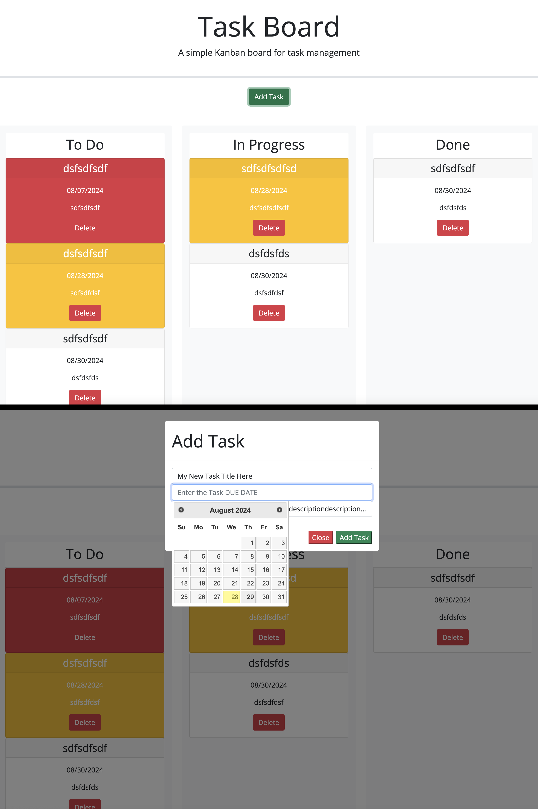

<h1 id="title">ReadMe file for "A Unique Task Manager"</h1>
<h3>By User davehyler</h3>
<!-- Optional Screenshot will show if user places one within the same directory as this readme. -->

 
<nav>
<h2>Table Of Contents</h2>
<ol>
<li><a href="#title">Title</a></li>
<li><a href="#username">Username</a></li>
<li><a href="#email">Email</a></li>
<li><a href="#stack">Stack</a></li>
<li><a href="#license">License</a></li>
<li><a href="#description">Description</a></li>
<li><a href="#instructions">Instructions</a></li>
<li><a href="#usage">Usage</a></li>
<li><a href="#guidelines">Guidelines</a></li>
<li><a href="#testing">Testing</a></li>
</ol>
</nav>
<ul class="list-group">
<h2>Project Information</h2>
<h3 id="stack">Stack used:</h3>

HTML,JavaScript,CSS

<h3 id="license">License: MIT</h3>

Badge: 

<h3 id="description">Description of project:</h3>

This is a simple Employee Payroll Tracker

<h3 id="instructions">Instructions:</h3>

Follow link below to deployed Website (https://davehyler.github.io/UniqueTasks/), press the only button on the body of the page, and follow all prompts.

<h3 id="usage">Each of the following has been completed from the source readme:</h3>GIVEN a task board to manage a project
WHEN I open the task board
THEN the list of project tasks is displayed in columns representing the task progress state (Not Yet Started, In Progress, Completed)
WHEN I view the task board for the project
THEN each task is color coded to indicate whether it is nearing the deadline (yellow) or is overdue (red)
WHEN I click on the button to define a new task
THEN I can enter the title, description and deadline date for the new task into a modal dialog
WHEN I click the save button for that task
THEN the properties for that task are saved in localStorage
WHEN I drag a task to a different progress column
THEN the task's progress state is updated accordingly and will stay in the new column after refreshing
WHEN I click the delete button for a task
THEN the task is removed from the task board and will not be added back after refreshing
WHEN I refresh the page
THEN the saved tasks persist

<h3 id="guidelines">Guidelines for Contribution:</h3>

To contribute, please upload your code or alterations to a commit and it will be reviewed.

<h3 id="testing">Tests</h3>

N/A. If you would like to write a test for these functions, feel free.

</ul>
<h3>Questions? Contact Me:</h3>
<ul class="list-group">
<li class="list-group-item" id="username">GitHub username: davehyler</li>
<li class="list-group-item" id="email">Email:  davehyler@github.com (placeholder since this is a publicly accessible and scrapable page)</li>
</ul>
<a href = "https://davehyler.github.io/unique-employee-payroll-tracker/">Launch Payroll Application Here</a>
